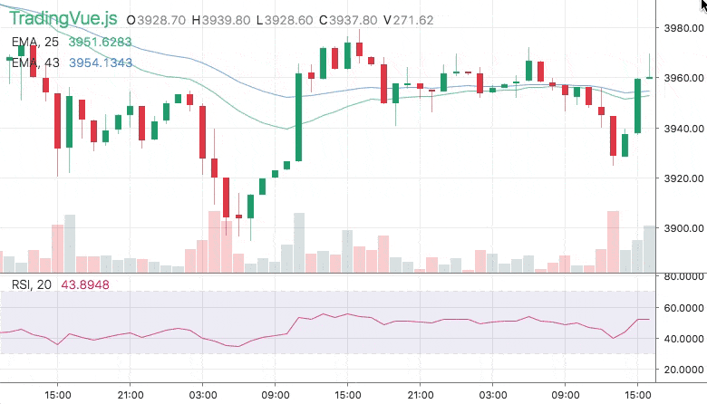

  

# TradingVue.js

**TradingVue.js** is a hackable charting lib for traders. You can draw literally ANYTHING on top of candlestick charts.

## Why?

I've been using [TradingView.com](https://www.tradingview.com) for several years and oh boy, I like this service.
But when it came to writing custom trading software there was no charting library with the same level of usability, not even near. There **WAS** no lib.

 

 

## Features

* Scrolling & zoomming as we all like
* Simple API for making new overlays
* No need for fancy math!
* One overlay === one .vue file (or .js)
* Fully reactive
* Fully responsive
* Customizable colors and fonts

## Demo & Docs

Oh yeah, here will be something cool.

## Install

Coming Soon

## How to use

Coming Sooner

## Roadmap

* Solve known issues (search for "TODO: IMPORTANT")
* Performance improvments
* Add more built-in overlays
* Add toolbar (drawing tools)
* Custom loayout / layout persistence
* Fix and improve mobile version

## Contribution

In progress
