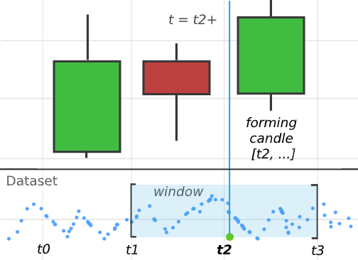

# Scripts: Brief Intro

## What

TVJS Scripts is a time-series engine, similar to the tradingview's PINE script. Syntax is based on javascript, in the future it will be possible to make custom code constructions with regular expressions (extend the language).

## State

At this moment 90% of the features are completed.

## Core concepts

**Timeseries (TS)** is a regular js Array with `__id__` and `__len__` properties (id & buffer length). New elements are added at the beginning of the TS:

```js
-> [2, 2, 2, 2, 2, 2]
```

The array is limited by `__len__` (applied each step).

**Std-lib** is a collection of built-in functions:

```
atr()
bb()
cci()
cmo()
dmi()
ema()
...
```

**Calculation object**. Overlay returns the script object from `calc()`:

```js
calc() {
    return {
        props: {
            start: { def: 10, text: 'Start Length' },
            number: { def: 5, text: 'Number of Lines' },
            step: { def: 10, text: 'Length Step' }
        },
        conf: {
            renderer: 'Splines'
        },
        init: `
            consol.log('init script')
        `,
        update: `
            let res = []
            for (var i = 0; i < number; i++) {
                let l = start + i * step
                var.push(ema(close, l)[0])
            }
            return res
        `,
        post: `
            console.log('post the results')
        `
    }
}
```
`init()` is called once, before any updates
`update()` is executed at each step. Should return a new data point (or set `this[0]`). Imagine that output of the function is pushed to your overlay's `data` array.
`post()` is called after all updates.

If `renderer` is specified, the lib will use another overlay for rendering the script (it should be added to the `overlays` prop of course).

If you need to create a persistent variable, just make a new property in `this`:

```js
{
    init: `
        this.state = 0
    `,
    update: `
        this.state++
    `
}
```

## How To Apply PINE Knowledge

Both engines are very similar, except TVJS has less syntax sugar (this improvement is planned). For example:

```js
// PINE:
hl2 = (high + low) / 2

// TVJS:
let hl2 = ts((high[0] + low[0]) / 2)
```

Sometimes you need to build a new TS with the `ts(x)` function. This function takes `x` and records it every step. Then you can use it as a source in the build-in functions:

```js
let hl2 = ts((high[0] + low[0]) / 2)
return ema(hl2, 100)[0]
```

## What To Avoid

Currently you can get issues with the following code constructions:

```js
// Avoid complex indices (brackets inside brackets):

ts1[[i][0] + arr[n]]

```

# Scripts: Basics

## How to make your own indicators

A good way to start is to take one of your best PINE scripts and try to convert it to TVJS scripts. If you don't know PINE and how it works, it's highly recommended to go through some of the tutorials on the internet.

From a multiyear experience of the project's creator, the reverse time-series method used in both engine is THE BEST way to construct TA studies. It's expressive, compact and thanks to the modern javascript, its implementation is much faster than similar ones written in Python.

With this script engine it's possible to run almost any math on finance data and obviously data-mine it to the oblivion (bad practice tho).

Some function are named differently than in PINE:

```js
percentile_linear_interpolation() // [WIP]
percentile_nearest_rank() // [WIP]
```

And there are some brand new:

```js
nf(x, v) // Replaces value with NaN or v if x is Infinite
ts(x) // Create new Time-series & update with value x
tstf(x, tf) // Create new TS with the timeframe
sub(x, y) // Subtract Number/TS
mult(x, y) // Multiply Number/TS
div(x, y) // Divide Number/TS
neg(x) // Negative Number/TS
modify(id, fields) // Overwrite overlay's fields, id = DC query
onchart(x, name, sett) // Draw point x onchart
offchart(x, name, sett) // Draw point x offchart
onclose(tf) // Called when the candle<TF> will be closed on the next t
settings(upd) // Modify this overlays's settings with upd
sym(x, y) // Creates a new symbol, see Samplers & Symbols
```

## Meta constants

Some useful info is available through the following constants:

```js
t // current timestamp
iter // current Script Engine (SE) data index (step)
tf // timeframe of the main chart
range // Current tv range [t0, t1]
se // Script Engine itself
settings // Current script settings (object)
data // Output data of the script (direct order)
ohlcv // Main OHLCV data (direct order)
self // Script Env object
shared // Shared data b/w all scripts
```

## TF symbols

To make things easier, here is some syntax sugar:
```js
open12H
high1D
low1m
close177m
vol24H
```

These are all valid TS names (the underlying data will be aggregated with the tf):

```js
`<name><number>(<letter>)` // close1000  means 1000ms aggregation
```

The same thing applies to some STD function:

```js
tr60m()
atr4H()
kc6H()
dmi12H()
kcw1D()
dmi3D()
sar1W() // Current doesn't work WIP
supertrend1M()
wpr1Y()
```

The other functions can detect the timeframe from one of their parameters:

```js
let ts1 = tstf(close, '1D')
ema(ts1, 200) // 200 days EMA
```

## Samplers & Symbols

A simple OHLCV sampler is created every time you use a TS or function with a custom timeframe. For example:

```js
close12H // Creates one 'close' sampler
atr12H(14) // Creates 3 samplers: 'high, low, close'
tstf(high, '12H') // Creates one 'high' sampler
```

If you print any of these time-series with `console.log()`, you'll find an additional `__fn__()` property. It's called each step.
The task of the std sampler is simple: aggregate data points and close the current chunk (candle) when it is time to do so.

So far so good. But what if you have some alternative sparse data? For example, you want to incorporate Open Interest or market trades into your study:

<br>

<div align="center">
  
</div>

*Note that candles start at t0, t1, t2 respectively, although the bodies are shown in-between*

<br>

To create a sampler(s) for this task you need to call `sym` function :

```js

data: {
    // Defines a dataset slot with type "DataType"
    dataset1: { type: 'DataType' }
},
update: `
    let symbol = sym(dataset1)

    let symbol2 = sym(dataset1, {
        // Symbol settings (Optional)
        tf: '1H',
        window: '2H'
    })

    offchart(symbol.close)
    offchart(symbol2.vol)
`
```

You also need to provide a dataset to DC (dataset is very similar to a regular onchart/offchart data, but lives in WebWorker):

```js
onchart: [...],
offchart: [...],
datasets: [{
    type: 'DataType',
    id: 'dataset-id',
    data: [...]
}]
```

After all is set, `symbol` and `symbol2` will contain 5 samplers: `open`, `high`, `low`, `close` and `vol`. The provided dataset by default should follow one of the two following formats (for 'ohlcv' aggregation):

```js
[time, open, high, low, close, vol]
[time, price, vol]
```

You can redefine the format depending on your data:

```js
let symbol1 = sym(dataset1, {
    // equals to [12346778891011, 100000]
    format: 'time:close'
})

let symbol2 = sym(dataset1, {
    // equals to [12346778891011, 100000, 111.5], where
    // open === high === low === close
    format: 'time:open,high,low,close:vol'
})
```

If you need a custom aggregation, change the `aggtype`:


```js
let symbol1 = sym(dataset1, {
    format: 'time:close',
    window: '2H',
    aggtype: arr => {  // E.g. average value
        sum = 0
        arr.forEach(x => {
            sum += x[1]
        })
        return sum
    }
})
offchart(symbol.close)
```

Every time `update()` is called your aggregation function gets all data data points in the current window (see the picture above). The window can be bigger or smaller than the main tf, by default it equals `tf`, meaning you'll get all the points corresponding to the current candle.


## Script execution modes

## Offchart & onchart

## Script Engine Modules

## Backtesting
