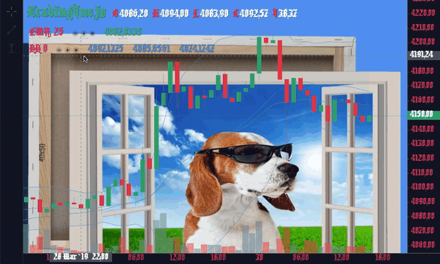

# Extensions Guide

This guide's version is **1.0.0**


## Why & How

To keep the core library size relatively small, it was decided to introduce a simple (not yet) way to extend the functionality. The main project consists of the two major parts: **TradingVue** component (renderer) and **DataCube** (data helper). An extension can manipulate the behaviour of both of them. The internal functions of `TradingVue` can be accessed through `tv` and `tv.$refs.chart`, the inner-works of `DataCube` is available through the `dc` reference & its events can be caught with `pre_dc` and `post_dc` functions.

## X Structure

Every extension can contain the following parts:

* Widgets
* Components
* Overlays
* Skins
* Colorpacks

If you check the repo with the standard pack https://github.com/tvjsx/tvjs-xp you'll find that each extension contains `x.json` file with this structure. For example, https://github.com/tvjsx/tvjs-xp/blob/main/src/extensions/settings-win/x.json includes only one widget

```json
{
    "name": "settings-win",
    "author": "StdSquad",
    "version": "1.0.0",
    "components": [],
    "widgets": ["SettingsWin.vue"],
    "overlays": [],
    "skins": [],
    "colorpacks": [],
    "deps": {}
}
```

This repo uses a special building process, so it transforms `x.json` into the corresponding `index.js` files (e.g. https://github.com/tvjsx/tvjs-xp/blob/main/build/settings-win/settings-win.js). You can start developing extension by cloning this repo & following the built-in process. To make a development index and building the library you'll need 2 commands:

```bash
npm run compile
npm run build
```

Otherwise, you can just make an index file similar to the one shown above and include it directly into your app.
An array of compiled extensions should be plugged in the corresponding prop:

```html
<!-- DataCube is needed -->
<trading-vue :data="dc" :extensions="[...]"/>
```

## Controller

A controller lies in the heart of every extension. Its main responsibilities are: registering event listeners, creating new widgets, serving as a hub between widgets/components. The basic example:

```js

// Extension's controller

export default class Main {

    constructor(tv, dc, sett) {

        this.widgets = {} // Installed Widgets
        this.tv = tv      // Reference to TradingVue
        this.dc = dc      // Reference to DataCube
        this.sett = sett  // X Settings

    }

    // Listens to all tvjs events (& dc events)
    update(e) {
        switch(e.event) {
            case 'range-changed': break
            // ...
        }
    }

    // Extensions settings has changed
    // (for all registered extensions combined)
    onsettings(all) {
        this.sett = all['ext-id']
    }

    // Called before the destruction
    destroy() {

    }

}

```

Mouse events can be handled with the native listeners:

```js
constructor() {
    setTimeout(() => {
        this.tv.$el.addEventListener(
            'mousemove',
            this.onmousemove.bind(this)
        )
    })
}

onmousemove(e) {
    // ...
}

destroy() {
    this.tv.$el.removeEventListener(
        'mousemove',
        this.onmousemove
    )
}
```

To communicate between widgets/components and the controller you can use a simple event bus class:

```js

/* --------- event_bus.js ---------- */
export default class EventBus {
    constructor() {}
    send(to, e) {
        let h = this[`on${to}`]
        if (h) h(e)
    }
}

/* ---------- Controller ----------- */

import EventBus from './event_bus.js'
var bus = new EventBus()

bus.onDifferentEvent = () => {}
bus.send('SomeEvent ', {})

export default class Main {}
export bus

/* ------ Widget / Component ------ */

import bus from './main.js'

bus.onSomeEvent = () => {}
bus.send('DifferentEvent', {})

```

## Widgets

Widgets are components living in the widget layer of `TradingVue` component. How to create a new widget? Ez:

```js

/* ----------- Widget.vue ---------- */

export default {
    name: 'Widget',
    // The props provided by the lib
    props: ['id', 'main', 'dc', 'tv', 'data'],
    mounted() {}
}

/* ---------- Controller ----------- */

import Widget from './Widget.vue'

// Generating a unique widget id
let id = `Widget-${Math.random()}`
this.tv.$set(this.widgets, id, {
    id,
    cls: Widget,
    data: { } // Arbitrary data
})

```

Removing a widget can be done in a similar way:

```js

/* ---------- Controller ----------- */
// ...

remove_widget(id) {
    this.tv.$delete(this.widgets, id)
}
```

## Components

This category should be selected when you need to make a stand-alone vue component that interact with the main chart. A good example is a buy/sell panel which can add orders to the chart.

If your component is named `BuySellPanel`, it can be imported directly from the index:

```js
import { BuySellPanel } form 'my-extension'
```

Or if you are building it with the TVJS-XP repo:

```js
import XP from 'xp'
const BuySellPanel = XP['my-extension'].BuySellPanel

Vue.use(BuySellPanel)
```

## Overlays

Overlays are automatically added to the main chart collection. That's it.

<details><summary>Spolier</summary>
<p>
Oh and you can also connect them to the main controller via `EventBus`. Sounds like a lot of new possibilities, huh?
</p>
</details>

## Skins

Here is the best part. Tired of black & white backgrounds and boring "eye-friendly" color themes? Now it is time to go full rampage!

<br>
<div align="center">
  
</div>
<br>

A skin is defined by a simple object:

```js
export default {
    id: 'SuperDogSkin',      // Skin id
    colors: DogPack,         // Color Pack
    shaders: [BackShader],   // Background Shaders
    font: '20px Kingthings', // Font
    styles: Styles           // Global css stylesheet
}
```

BackShader is similar to the [InlineShader](https://github.com/tvjsx/trading-vue-js/blob/master/docs/api/SHADERS.md) and allows you to cover the areas of Grid, Sidebar or Botbar with a custom graphics. The props provided by the library contain all necessary information to make an interactive visualisations.

Examples of back shaders can be found [here](https://github.com/tvjsx/trading-vue-js/blob/master/test/tests/Extensions/Alps/back_shader.js) and [here](https://github.com/tvjsx/trading-vue-js/blob/master/test/tests/Extensions/SkinPack/back_shader.js).

## Color Packs

Colorpack is a json object with all colors to be replaced. The names come from the main component's props, without `color` prefix:

```json
{
    "candleDw": "#23a776",
    "candleUp": "#23a776",
    "cross": "#23a776",
    "grid": "#23a77622",
    "panel": "#23a77655",
    "scale": "#23a77655",
    "tbBorder": "#23a77655",
    "text": "#23a776",
    "textHL": "#23a776",
    "title": "#23a776",
    "volDw": "#23a776",
    "volUp": "#23a776",
    "wickDw": "#23a776",
    "wickSm": "#23a776",
    "wickUp": "#23a776"
}
```

## X Settings

To provide a settings object (shown in #Controller) use `x-settings` prop:

```html
<trading-vue :x-settings="xsett"/>
<script>
export default {
    data() {
        return {
            xsett: {
                'extension-id-1': { /* ... */ },
                'extension-id-2': { /* ... */ }
            }
        }
    }
}
</script>
```

## Chart-event hooks

If you need to set up hooks to the internal events, use `$refs.chart.hooks(...args)`, where `args` is an array of hook names. Currently supported hooks: `xchanged, xlocked, update, resize, data`.

After the call you'll be getting events like this `?<hook name>`:

```js
// Extension's controller

export default class Main {

    // ...

    // Listens to all tvjs events (& dc events)
    update(e) {
        switch(e.event) {
            case '?x-changed': break
            // ...
        }
    }

}
```

## Useful tips

The chart layout can be accesed through `tv.$refs.chart._layout`
