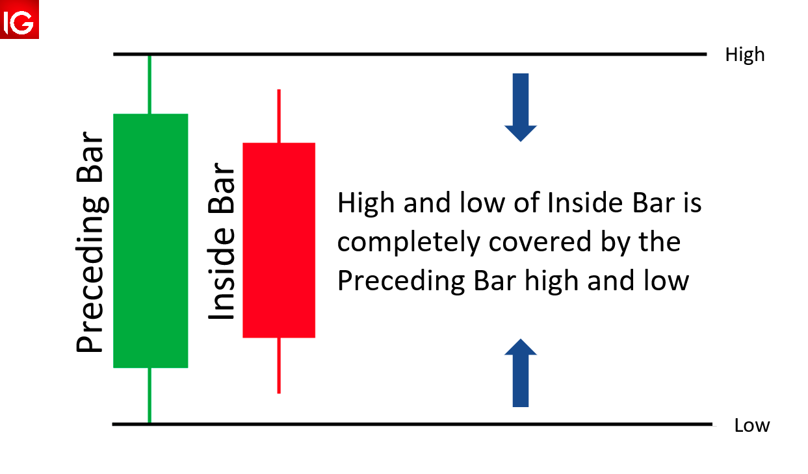

# Overlays Guide

This guide's version is **1.0.0**


As the title says, this guide is for OGs, meaning you'll need to have some experience with the project and Vue.js.

**The 101 guide**: https://github.com/tvjsx/trading-vue-js/tree/master/docs/guide

**The app for testing**: https://github.com/tvjsx/trading-vue-101

**Introduction to scripts**: https://github.com/tvjsx/trading-vue-js/blob/master/docs/guide/SCRIPTS.md

## Prerequisites

* Know how to build webpack-based projects in npm environment
* Know what is Vue component (methods, props, etc)
* Basic knowledge of canvas API
* Some experience with the lib (DataCube, overlays)
* Brief introduction to scripts

## What is Overlays?

Basically, overlays are Vue components without the render function or template. Well, actually there is a render function called `draw()`, but it is used by the library and not directly by Vue.js.

When you add new overlay (OV) to your data object, e.g.:

```js
onchart: [{
    name: 'OverlayKing',
    type: 'OverlayKing',
    data: [...],
    settings: {}
}]
```

the core lib searches among registered OVs for the type `OverlayKing` and creates the corresponding component.

It's important to note that overlays are somewhat similar to shaders, they only see a subset of the time-series data (the visible range), so performance is optimal. You'll learn how to access all available data if needed further.

## Null Overlay

Let's create an invisible overlay with all available methods:

`Ghost.vue`
```html
<script>


import { Overlay } from 'trading-vue-js'

export default {
    name: 'Ghost',
    mixins: [Overlay],
    methods: {
        // Meta info & presets
        meta_info() {
            return { author: 'OG', version: '1.0.1' }
        },

        // Called once when the component in mounted
        init() {},

        // Drawing method (ctx - canvas context)
        draw(ctx) {},

        // Types rendered by this this component
        use_for() { return ['Ghost'] },

        // Data colors for the legend
        data_colors() { return ['green'] },

        // Custom legend values
        legend(values) { return [] },

        // Custom vertical range (e.g. for RSI)
        y_range(hi, lo) { return [hi, lo] },

        // Should be defined if this is a drawing tool
        tool() { return {} },

        // The script
        calc() { return { update: `` } }
    },
    // Define internal setting & constants here
    computed: {
        // Settings shortcut
        sett() {
            return this.$props.settings
        }
    },
    data() { }
}
</script>
```

If you add this overlay into the **trading-vue-101** app, you'll see absolutely nothing. Well, that was expected. In the next sections you'll learn how to fill it with tons of code and make it do at least something (no, it won't trade on your behalf... Or maybe it will? Let's find out).

## Meta Info

The meta object should be used to add an arbitrary data, such as a github repo address or website of the creator. However it includes several reserved/required fields. For example:

```js
meta_info() {
    return {
        version: '1.0.0', // Required
        author: 'Satoshi Smith', // Required
        desc: 'Description', // Recommended
        preset: {}, // Optional
        contact: '<email>',  // Arbitrary
        github: '<GitHub Page>' // Arbitrary
    }
}
```

Preset can define an initial set of parameters for the OV. The **legend-bittons** extension (https://github.com/tvjsx/tvjs-xp) supports them through the `+` button:

```js
preset: {
    name: 'ATR $length', // Name template
    side: 'offchart', // Where the overlay should be placed
    settings: { // Init Settings
        lineWidth: 0.75,
        color: '#e52468'
    }
}
```

## Init

Called when an overlay is mounted, can be used to setup pins or/and to initialise some primitives:

```js
init() {
    // New primitive
    this.price = new Price(this)

    // Add pins (if the overlay is a tool)
    this.pins.push(new Pin(this, 'p1'))
    this.pins.push(new Pin(this, 'p2'))
}
```

## Draw

Simply put, it's a rendering function with a bunch of Canvas API calls (https://developer.mozilla.org/en-US/docs/Web/API/Canvas_API).

You can use standard lines, rectangles and images, to name a few. To get screen coordinates from time & price data points use the layout mapping functions (https://github.com/tvjsx/trading-vue-js/tree/master/docs/api#mapping-functions):

```js
draw(ctx) {
    const layout = this.$props.layout
    const data = this.$props.data
    for (var p of data) {
        let x = layout.t2screen(p[0]) // maps t => x
        let y = layout.$2screen(p[i]) // maps $ => y
        ctx.lineTo(x, y)
    }
}
```

The canvas context saved before the `draw()` call and restored after. This allows to clear settings such as `lineWidth` and `strokeStyle` from the previous layer (read more [here](https://developer.mozilla.org/en-US/docs/Web/API/CanvasRenderingContext2D/save)):

*code from the core lib, "grid.js":*
```js
// z-index sorting
overlays.sort((l1, l2) => l1.z - l2.z)

overlays.forEach(l => {
    //...
    this.ctx.save()
    //...
    r.draw(this.ctx)
    //...
    this.ctx.restore()
})
```

As you can see all layers sorted by z-indices before rendering, the corresponding settings described here: https://github.com/tvjsx/trading-vue-js/tree/master/docs/overlays#general-settings.

## Use For

You can specify several types that will "trigger" your overlay. It's recommended to use only one if you are making an overlay for publishing.

```js
use_for() {
    return ['OverlayKing', 'OK']
}
```

If you create an OV using one of the built-ins types (https://github.com/tvjsx/trading-vue-js/tree/master/docs/overlays), it will overwrite them. Similarly, elements with bigger indices in the `overlays` array will be used instead of the previous ones (assuming the same type):

```html
<template>
<trading-vue :data="data" :overlays="overlays"/>
</template>
<script>
export default {
    data() {
        return {
            // If all 3 overlays have the 'Spline' type,
            // OV3 will be selected for rendering
            overlays: [OV1, OV2, OV3] // OV3 got it
        }
    }
}
</script>
```
*Preferably type names should use CamelCase*

## Data Colors

To customise legend colors, add the `data_colors()` method returning an array of consecutive hex values/names:

```js
data_colors() {
    return ['#00ff00', 'green']
}
```

It should work when the time series data is a simple 2D array:

```json
[
    [ 1551128400000, 1, 2, 3 ],
    [ 1551132000000, 2, 3, 4 ],
    [ 1551135600000, 3, 5, 6 ]
]
```

```js
data_colors() {
    return ['red', 'green', 'blue'] // for [1, 2, 3] respectively
}
```

## Legend

An extended version of the previous method, which also supports custom legend values:

```js
// Will produce: "OverlayKing 10 v=2 [2,3]"
legend(values) {
    return [{
        value: values[0] * 10, // custom formatter
        color: 'red'
    }, {
        value: `v=${values[1]}` ,
        color: 'green'
    }, {
        value: [values[1], values[2]],
        color: 'blue'
    }]
}
```

## Y-Range

For some overlays there a requirement to provide a fixed vertical range, for example RSI should always show the bands (30 & 70 levels), so in this case we can modify a pre-calculated y-range:

```js
y_range(hi, lo) {
    return [
        Math.max(hi, this.sett.upper || 70), // new high
        Math.min(lo, this.sett.lower || 30) // new low
    ]
}
```

By default the library adds a small margins above and below the range, to disable them push the third value as `false`:

```js
y_range(hi, lo) {
    return [hi, lo, false]
}
```

## Tool

Tool is a special kind of overlay. It retains all the qualities of a regular OV and adds a new functionality: interactivity. To activate this feature you'll need a couple of things:

* import Tool mixin, include it in `mixins`
* define the `tool()` method with a descriptor

```js
import { Overlay, Tool } from 'trading-vue-js'

export default {
    name: 'GhostBlaster',
    mixins: [Overlay, Tool],
    methods: {
        tool() {
            return {
                // Sub Type, shown as 'GhostBlaster:Gun'
                type: 'Gun'
            }
        },
        // ...
    }
}
```

After that, the tool will be automatically registered in [DataCube](https://github.com/tvjsx/trading-vue-js/tree/master/docs/datacube) every time the overlay is created.
As mentioned earlier, with imported `Tool` mixin you can create **Pins** inside the `init()` method:

```js
init() {
    // First pin is settled at the mouse position
    this.pins.push(new Pin(this, 'p1'))
    // Second one is following mouse until it clicks
    this.pins.push(new Pin(this, 'p2', {
        state: 'tracking'
    }))
    this.pins[1].on('settled', () => {
        // Call when current tool drawing is finished
        // (Optionally) reset the mode back to 'Cursor'
        this.set_state('finished')
        this.$emit('drawing-mode-off')
    })
}
```

Points `p1` & `p2` will appear in the `settings` object. Then, using the point coordinates, you can connect them the way you like and draw any shapes based on their positions:

```js
draw(ctx) {
    // Check that the points exist
    if (!this.p1 || !this.p2) return

    // Mapping
    let x1 = layout.t2screen(p1[0])
    let y1 = layout.$2screen(p1[1])
    let x2 = layout.t2screen(p2[0])
    let y2 = layout.$2screen(p2[1])

    this.ctx.moveTo(x1, y1)
    this.ctx.lineTo(x2, y2)
}
// ...
computed: {
    p1() {
        return this.$props.settings.p1
    },
    p2() {
        return this.$props.settings.p2
    }
}    
```

You can also use a predefined primitives, which can be imported as `import primitives form 'trading-vue-js'`. (the source codes are here:  https://github.com/tvjsx/trading-vue-js/tree/master/src/components/primitives)

### Tool Descriptor

Of course, a full tool descriptor contains much more settings. Let's look at the built-in `LineTool` overlay in great detail (https://github.com/tvjsx/trading-vue-js/blob/master/src/components/overlays/LineTool.vue):

```js
tool() {
    return {
        // Group defines the category where the tool will be placed
        group: 'Lines',
         // An icon must be in DataUrl format, 25x25 by default
        icon: Icons['segment.png'],
        type: 'Segment', // Sub-type
        data: [],     // Default data
        settings: {}, // Default settings
        // Modifications
        mods: {
            'Extended': {
                // Rewrites the default setting fields
                settings: { extended: true },
                icon: Icons['extended.png']
            },
            'Ray': {
                // Rewrites the default setting fields
                settings: { ray: true },
                icon: Icons['ray.png']
            }
        }
    }
},
use_for() { return ['LineTool'] },
```

Modifications aka `mods`, overwrite the generic descriptor fields for a specific sub-types. For example, `settings` or `icon`. They will be visible in the toolbar as (for `LineTool`):

* LineTool:Segment
* LineTool:Extended
* LineTool:Ray

Also, when you drawing a tool there may be a need for some kind of initial setup (color, line thickness, etc). For this purpose there is a field in the [DataStructure](https://github.com/tvjsx/trading-vue-js/tree/master/docs/api#data-structure) called `tools`:

```json
{

    "tools": [
        {
            "type": "LineTool",
            "settings": {
                "color": "#35c460"
            }
        },
        {
            "type": "LineTool:Extended",
            "settings": {
                "color": "#3186c4"
            }
        },
        {
            "type": "LineTool:Ray",
            "settings": {
                "color": "#c43169"
            }
        }
    ]
}
```

## Calc

Here goes the beast. Scripts with almost [100 std functions](https://github.com/tvjsx/trading-vue-js/blob/master/docs/api/STDLIB.md), calculated in web worker and packaged with overlay. This feature will allow you to express 99% of trading ideas (excluding the most CPU/GPU-consuming ones).

The structure of `calc()` method is quite simple:

```js
calc() {
    return {
        props: {
            length: { def: 10, text: 'Length' },
        },
        conf: {
            // Use different renderer
            renderer: 'Spline'
        },
        init: `
            // Called before the steps
        `,
        update: `
            // Called at every step
            return ema(close, 200)
        `,
        post: `
            // Called after the run
        `
    }
}
```

You can read about scripts, how they work, and what features they offer [here](https://github.com/tvjsx/trading-vue-js/blob/master/docs/guide/SCRIPTS.md).

### The MACD example

To get some understanding on how a full overlay with the script looks like, checkout the MACD indicator: https://github.com/tvjsx/tvjs-overlays/blob/master/src/overlays/MACD/MACD.vue

Here's how it all works:

* You add data to `offchart` array with the type `MACD` and an empty `data` array
* The library mounts the overlay and sends `exec-script` to DataCube (DC)
* DataCube sends the script with the current settings to web-worker
* Web-worker runs the ScriptEngine, executes the code and sends a result back
* DataCube receives the result and overwrites the `data` array.
* The overlay part of the indicator gets updated data & renders it with `draw()`
* Following real-time events from DC will be updating the indicator values

Inside the ScriptEngine, the script functions run in this specific order:

```js
init()
update() // x Number of candles
post()
```

*`init()` & `post()` are empty in the case of MACD*

This overlay has an impressive preset with all the colors, line styles and the name template `MACD $fast $slow $smooth`. If you want to use something different than [TVJS XP](https://github.com/tvjsx/tvjs-xp) (remember the `+` button?), you'll need to implement the preset parsing feature in your app.

### Accessing all OHLCV data

For overlays that need to access more data than the current visible range contains, there is a solution: use a script to do all necessary pre-calculations. The script can present data in a form that is ready to display. Let's look at example.

Suppose that an overlay needs to look back to detect inside bars:

<center>



</center>

Ok, we could calculate inside bars in the main loop in the `draw()` method, but the problem is that the leftmost candle has no previous data point in `this.$props.data`. So we can just add a script that produces data like this:

```js
[
    [ 1551128400000, false ],
    [ 1551132000000, false ],
    [ 1551135600000, true ] // Inside bar
]
```

And feed it back to the overlay. That's how it looks:

```js
draw() {
    for (var p of this.$props.data) {
        if (p[1]) {
            // Overlay candle with a different color
            // using 'candle.js' primitive && layout.candles
        }
    }
}
// ...
calc() {
    update: `
        return high[0] < high[1] && low[0] > low[1]
    `
}
```

### Using Datasets

For some cases where you need to use multiple data sources or the output of an overlay looks completely different than the source data, there are **datasets**. Dataset is an element of [DataStructure](https://github.com/tvjsx/trading-vue-js/tree/master/docs/api#data-structure) that is completely invisible to the rendering engine, but can be accessed from scripts. Also, it can be updated with DC as a regular overlay.

*[A fragment from the DC example](https://github.com/tvjsx/trading-vue-js/blob/master/test/tests/DataHelper.vue)*

```js
this.chart = new DataCube({
    // ...
    datasets: [{
        type: 'Trades',
        id: 'binance-btcusdt',
        data: []
    }]
})
```

```js
on_trades(trade) {
    this.chart.update({
        t: trade.T,     // Exchange time (optional)
        price: parseFloat(trade.p),   // Trade price
        volume: parseFloat(trade.q),  // Trade amount
        'datasets.binance-btcusdt': [ // Update dataset
            trade.T,
            trade.m ? 0 : 1,          // Sell or Buy
            parseFloat(trade.q),
            parseFloat(trade.p)
        ]
        // ... other onchart/offchart updates
    })
}
```

```js
// ...
data: {
    trades: { type: 'Trades' }
},
update: `
    let balance = sym(trades, {
        aggtype: arr => {
            var buys = 0, sells = 0
            arr.forEach(x => {
                if (x[1]) buys += x[2]
                else sells += x[2]
            })
            return nf(buys / (buys + sells))
        }
    })
    return balance.close
`
```

A dataset plus sampler can also be used to create the main chart from trades:

```js
// Will fill the main chart `data` array
init: `
    sym(trades, { main:true })
`
```

By default the trades dataset must have the following format:

```json
[
    [1600319710248, 0.0000461, 33],
    [1600319762930, 0.00004612, 33],
    [1600319783918, 0.00004612, 31]
]
```

Alternatively, the format can be changed (where `:` is an element separator):

```js
init: `
    sym(trades, { main:true, format: 'time:vol:close' }
`
```

### Live trading

The main question: can an overlay be a fully-functional trading program? The answer is **yes**! You can make a fully functional trading bot with overlay only. Of course, if you prefer to handle trading signals in your app, you can do that too.

As always, an example will explain it better. What strategy shall we use? You guessed it right:

*ema_crossover.vue*

```html
<script>

import { Overlay } from 'trading-vue-js'

export default {
    name: 'EMAX',
    mixins: [Overlay],
    methods: {
        meta_info() {
            return {
                author: 'GoodMoney$$$', version: '1.0.0',
                desc: 'EMA crossover startegy'
            }
        },
        use_for() { return ['EMAX'] },
        calc() {
            return {
                props: {
                    fastL: { def: 5, text: 'Fast EMA' },
                    slowL: { def: 20, text: 'Slow EMA' }
                },
                conf: { renderer: 'Splines' },
                update: `
                    let fast = ema(close, fastL)
                    let slow = ema(close, slowL)
                    let buy = crossover(fast, slow)[0]
                    let sell = crossunder(fast, slow)[0]
                    if (onclose()) {
                        signalif(buy, 'pump-it')
                        signalif(sell, 'dump-it')
                    }
                    if (buy || sell) {
                        onchart(
                            [buy ? 1 : 0, close[0], buy ? 'L' : 'S'],
                            'Trades',
                            { type: 'Trades', zIndex: 1 }
                        )
                    }
                    onchart([fast, slow])
                `
            }
        }
    }
}
</script>

```

*your_electron_app.html*

```html
<template>
<trading-vue :data="data" @signal="onsignal"/>
</template>
<script>
export default {
    mathods: {
        onsignal(e) {
            switch(e.type) {
                case 'pump-it':
                    binance.createMarketBuyOrder()
                break
                case 'dump-it':
                    binance.createMarketSellOrder()
                break
            }
        }
    }
}
</script>
```

## Pro Tips

* If you want to get crispy pixel-perfect lines, try to add/subtract 0.5 from px coordinates.
* Combining primitives with the same style into one path will speed-up the overlay.
* Sometimes you need to quickly prototype an overlay, http://tvjs.io/play is the place to go
* You can pre-render repetitive drawing calls with [OffscreenCanvas](https://developer.mozilla.org/en-US/docs/Web/API/OffscreenCanvas)
* To make direct requests to exchange from Vue.js, wrap it into [Electron](https://www.electronjs.org/)
